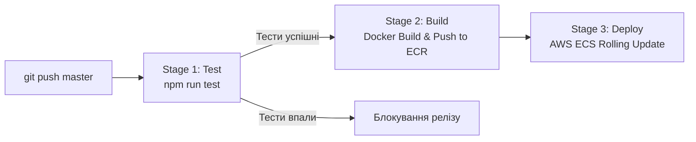

# NestJS Notes Todo App - Production DevOps & AWS Infrastructure

Production-ready NestJS Notes/Todo додаток із повною інфраструктурою як код (Terraform), контейнеризацією (Docker) та автоматизованим конвеєром безперервної інтеграції та доставки (GitLab CI / GitHub Actions) на AWS ECS Fargate.

---

## 🌟 Зміст проекту

1. [Локальний запуск через Docker Compose](#-локальний-запуск-через-docker-compose)
2. [Архітектура AWS інфраструктури](#-архітектура-aws-інфраструктури)
3. [Розгортання через Terraform](#-розгортання-інфраструктури-через-terraform)
4. [CI/CD Pipelines (GitLab CI & GitHub Actions)](#-cicd-pipelines)
5. [Структура репозиторію](#-структура-репозиторію)

---

## 🐳 Локальний запуск через Docker Compose

Для локальної перевірки роботи додатку разом із MongoDB підготовлено `docker-compose.yml`:

```bash
# Збірка та запуск контейнерів
docker compose up --build
```

Після запуску доступні наступні сервіси:
- **NestJS Todo API & Swagger UI:** [http://localhost:3000/api](http://localhost:3000/api) (інтерактивна документація для тестування створення, редагування та видалення нотаток).
- **API Healthcheck:** [http://localhost:3000/api/v1](http://localhost:3000/api/v1)
- **Mongo Express (Веб-інтерфейс бази даних):** [http://localhost:8081](http://localhost:8081) (Логін: `admin`, Пароль: `password`).

---

## ☁️ Архітектура AWS інфраструктури

Додаток розгортається у відмовостійкій та безпечній конфігурації **AWS ECS Fargate**:
- **Мережа:** Окрема VPC з 2 публічними та 2 приватними підмережами у різних Availability Zones (Multi-AZ).
- **Балансування:** Application Load Balancer (ALB) у публічних підмережах із перевіркою стану (Health Check) за маршрутом `/api/v1` та підтримкою SSL (ACM).
- **Обчислення:** AWS ECS Fargate Tasks у ізольованих приватних підмережах без прямого доступу з Інтернету.
- **Безпека:** Security Groups за принципом найменших привілеїв (ECS приймає трафік виключно від ALB).
- **База даних:** Керована хмарна NoSQL база [MongoDB Atlas](https://www.mongodb.com/cloud).
- **Логування:** Amazon CloudWatch Logs для централізованого збору логів додатку.

Детальний опис та схеми доступні в:
- 📄 [Документація архітектури](docs/aws-architecture.md)
- 📐 [Файл діаграми draw.io](aws-architecture.drawio) (відкривається на [app.diagrams.net](https://app.diagrams.net))

---

## 🛠 Розгортання інфраструктури через Terraform

Всі ресурси AWS автоматично створюються за допомогою коду у директорії `terraform/`:

```bash
cd terraform

# 1. Створення файлу змінних
cp terraform.tfvars.example terraform.tfvars
# (відредагуйте terraform.tfvars, вказавши свій database_uri від MongoDB Atlas)

# 2. Ініціалізація провайдера AWS
terraform init

# 3. Перегляд плану створення ресурсів
terraform plan

# 4. Застосування змін
terraform apply
```

Після виконання команди Terraform виведе публічну адресу балансувальника (`alb_dns_name`) та URL до Swagger UI (`app_url`).

---

## 🚀 CI/CD Pipelines

У проекті налаштовано автоматичний конвеєр для **GitLab CI** ([`.gitlab-ci.yml`](.gitlab-ci.yml)) та **GitHub Actions** ([`.github/workflows/deploy.yml`](.github/workflows/deploy.yml)):



- **Правило безпеки:** Якщо юніт-тести (`npm test`) зазнають невдачі, деплой блокується.
- **Детальний гайд із налаштування секретів:** [docs/ci-cd-setup.md](docs/ci-cd-setup.md).

---

## 📁 Структура репозиторію

```text
├── .github/workflows/deploy.yml # GitHub Actions workflow
├── .gitlab-ci.yml               # GitLab CI/CD pipeline
├── Dockerfile                   # Multi-stage production Dockerfile
├── .dockerignore                # Виключення файлів для Docker
├── docker-compose.yml           # Локальний стек з додатком та MongoDB
├── aws-architecture.drawio      # Діаграма архітектури для draw.io
├── docs/
│   ├── aws-architecture.md     # Повний опис архітектури AWS
│   └── ci-cd-setup.md          # Інструкція з налаштування CI/CD змінних
├── terraform/                   # Інфраструктура як код (IaC)
│   ├── versions.tf             # Провайдер AWS
│   ├── variables.tf            # Вхідні параметри
│   ├── terraform.tfvars.example# Приклад конфігурації
│   ├── vpc.tf                  # VPC, IGW, NAT Gateway, Subnets
│   ├── security_groups.tf      # Безпекові групи ALB та ECS
│   ├── alb.tf                  # Application Load Balancer
│   ├── acm.tf                  # SSL сертифікати ACM
│   ├── ecs.tf                  # ECS Cluster, Fargate Service, Task Def
│   ├── ecr.tf                  # Приватний AWS ECR репозиторій
│   ├── iam.tf                  # IAM ролі ECS Task та Execution
│   ├── cloudwatch.tf           # CloudWatch логи
│   └── outputs.tf              # Вихідні значення (ALB DNS, ECR URL)
└── src/                         # Вихідний код NestJS додатку
```