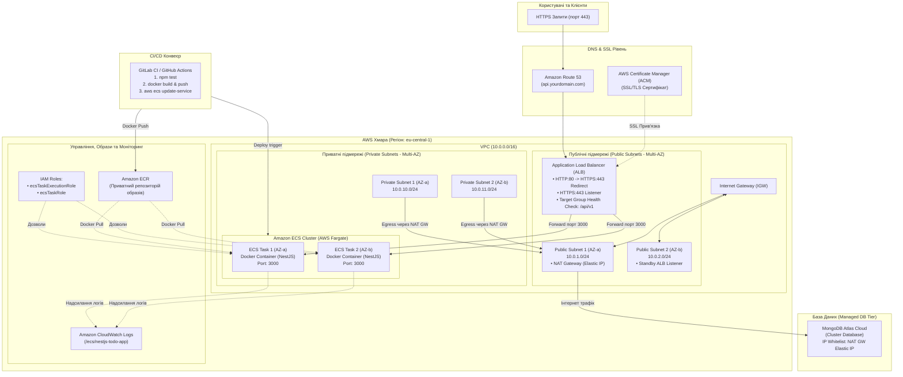

# AWS Production Інфраструктура для NestJS додатку

Даний документ містить детальний опис та обґрунтування архітектури production-середовища в хмарі AWS, спроектованої для NestJS додатку (Notes/Todo) згідно з вимогами надійності, безпеки та автоматизації.

Візуальну схему також збережено у форматі draw.io у файлі [`aws-architecture.drawio`](../aws-architecture.drawio), який можна імпортувати та редагувати на [app.diagrams.net](https://app.diagrams.net).

---

## 1. Архітектурна діаграма (Mermaid)

---

## 2. Опис рівнів та компонентів

### 2.1. Мережевий рівень (Network Tier)
- **VPC (`10.0.0.0/16`):** Ізольована віртуальна приватна хмара для розміщення ресурсів проекту.
- **Підмережі у двох Availability Zones (Multi-AZ):**
  - **Публічні підмережі (`10.0.1.0/24`, `10.0.2.0/24`):** Мають прямий маршрут до **Internet Gateway (IGW)**. Тут розміщується **Application Load Balancer (ALB)** та **NAT Gateway**.
  - **Приватні підмережі (`10.0.10.0/24`, `10.0.11.0/24`):** Не мають прямого доступу з Інтернету. Тут запускаються контейнери додатку в **ECS Fargate**. Весь вихідний інтернет-трафік (до MongoDB Atlas та ECR) маршрутизується через **NAT Gateway**.

### 2.2. Рівень балансування та безпеки (Security & Traffic Routing)
- **AWS Certificate Manager (ACM):** Забезпечує безкоштовний сертифікат SSL/TLS з автоматичним поновленням для шифрування трафіку (HTTPS).
- **Application Load Balancer (ALB):**
  - Слухач порту 80 (HTTP) автоматично перенаправляє користувачів на порт 443 (HTTPS) з кодом 301.
  - Слухач порту 443 (HTTPS) розшифровує SSL-трафік та передає його у Target Group.
  - **Health Check:** регулярна перевірка стану контейнерів за маршрутом `/api/v1` (код 200). Якщо таска перестає відповідати, ALB перестає спрямовувати на неї трафік, а ECS автоматично перезапускає її.
- **Security Groups (Принцип найменших привілеїв):**
  - `ALB Security Group`: відкриті порти 80 та 443 для всього світу (`0.0.0.0/0`).
  - `ECS Tasks Security Group`: **закрита від усього Інтернету**! Дозволяє вхідний трафік на порт 3000 **виключно** від `ALB Security Group`.

### 2.3. Рівень обчислень (Compute Tier - AWS ECS Fargate)
- **Чому обрано AWS Fargate:**
  - Fargate є безсерверним (serverless) рушієм для ECS. Нам не потрібно адмініструвати, оновлювати чи виправляти патчами віртуальні машини EC2.
  - Оплата відбувається виключно за фактично спожиті ресурси vCPU та RAM.
  - Автоматичне ізолювання контейнерів на рівні ядра.
- **High Availability (HA):** Завдання розгортаються щонайменше у 2 репліках у різних зонах доступності (`eu-central-1a`, `eu-central-1b`).
- **Rolling Deployment:** Під час деплою нової версії спочатку піднімається новий контейнер, проходить health check, і лише після цього старий контейнер зупиняється (Zero Downtime Deployment).

### 2.4. Рівень управління та дозволів (IAM Roles)
- **`ecsTaskExecutionRole`:** Роль, яку використовує сам агент ECS Fargate для підтягування Docker-образу з приватного AWS ECR та створення лог-стрімів у CloudWatch Logs.
- **`ecsTaskRole`:** Роль для самого коду додатку (якщо в майбутньому додатку знадобиться взаємодіяти з AWS S3, Secrets Manager чи іншими сервісами AWS без хардкоду ключів доступу).

### 2.5. Рівень моніторингу (Observability Tier)
- **Amazon CloudWatch Logs:** Логи `stdout` та `stderr` з усіх реплік автоматично збираються в CloudWatch Log Group `/ecs/todo-app-production` з налаштованим терміном ротації (наприклад, 14 днів).

### 2.6. Рівень даних (Database Tier)
- **MongoDB Atlas Cloud:** Керована база даних NoSQL. Для безпеки в налаштуваннях Network Access MongoDB Atlas вказується Elastic IP нашого AWS NAT Gateway, що забороняє будь-який сторонній доступ до бази даних.
